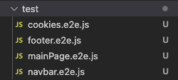
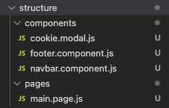
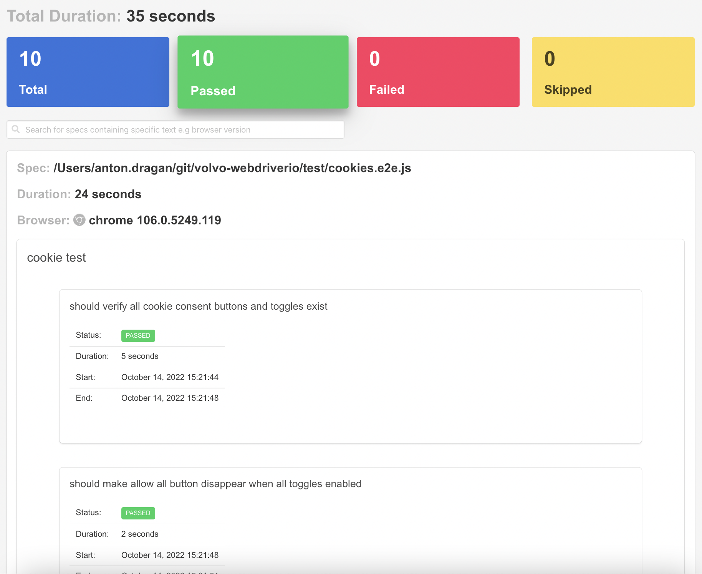

# Volvo Cars WebdriverIO test automation framework example

This project has 4 requirements:

1. Setup the solution and its Dockerized image
2. Parallel execution of tests
3. Reporting of the results
4. Documentation

We'll explain these one step at a time below.

## Setup the solution and its Dockerized image

- First, we initialized the project with `npm init`. Next, we set up WDIO with default settings by running `npx wdio config`. This will also create our folder structure and a couple of examle tests.
- We will keep page objects and components in the `./structure` folder and tests in the `./tests` folder.
- There is a single webpage that we need to test, `https://www.volvocars.com/intl/v/car-safety/a-million-more`, so we will hardcode it in case the BASE_URL process.env variable isn't passed.
- This webpage will have 1 page and 3 components: footer, header and cookie modal. We will therefore create 4 simple tests, one for each of the components.
- 
- 

### Dockerization

To run in a Dockerized environment, we would have to make a couple of changes.

First, we have to create a new file called `ci.conf.js` which would be identical to our main `local.conf.js` file but with a few modifications to the capabilites so that it runs in 1 single instance at a time and in headless mode:

```js
exports.config = {
  ...
  capabilities: [{
    maxInstances: 1,
    browserName: 'chrome',
    acceptInsecureCerts: true,
    'goog:chromeOptions': {
      args: [
        '--no-sandbox',
        '--disable-infobars',
        '--headless',
        '--disable-gpu',
        '--window-size=1440,735'
      ],
    }
  }],
  ...
```

Next, we have to create a Dockerfile that builds our image. The requirement is that it must have at least Chrome installed:

```Dockerfile
FROM cypress/browsers:node16.17.0-chrome106

WORKDIR /testing

COPY package*.json ./

RUN npm ci

COPY . .

CMD ["npm", "run", "test:ci"]
```

Finally, we have to build and run the container:

```bash
docker build --no-cache -t volvo-test -f Dockerfile .
docker run volvo-test
```

**Note**: This is not supported on ARM architecture (M1 or similar Mac) as it would cause Chrome to crash inside the Docker container. If that's necessary, the Dockerfile base image would need to be replaced with a version that supports ARM Chrome and the commands would become:

```bash
docker buildx build --platform linux/amd64 --no-cache -t volvo-webdriverio -f Dockerfile .
docker run --platform linux/amd64 volvo-webdriverio
```

## Parallel execution of tests

Test parallelism is enabled by default in `local.conf.js` so no changes are necessary to the codebase:

```js
exports.config = {
  ...
  maxInstances: 10,
  capabilities: [{
      maxInstances: 5,
      browserName: 'chrome',
      acceptInsecureCerts: true
  }],
  ...
```

## Reporting of the results

We have kept the spec reporter as it's nice-to-have when debugging locally. We have also added the WDIO Timeline Reporter to the codebase as it's a nice way to view results in an HTML format: `npm install --save-dev wdio-timeline-reporter`. You will find all the configuration in the `local.conf.js` file:

```js
const { TimelineService } = require('wdio-timeline-reporter/timeline-service')

exports.config = {
  ...
  services: [
    'chromedriver',
    [TimelineService]
  ],
  reporters: [
      'spec',
      ['timeline', {
        outputDir: './results'
    }],
  ],
  ...
```

Here's a preview of the HTML report this creates:

- 

## Documentation

The documentation is written in (this) README.md file. Leveraging markdown we can make a quick, formatted, easy-to-read and easy-to-maintain guide on how to run the tests.
